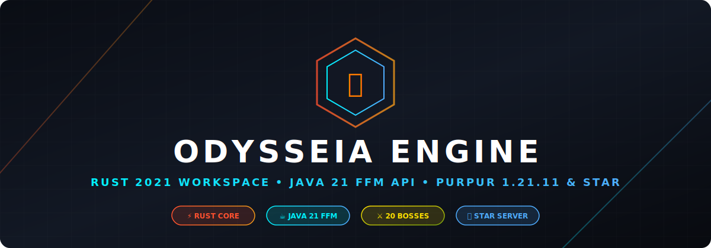

# Odysseia v1.1.0

<p align="center">
  
</p>

<p align="center">
  <strong>Núcleo Mítico, Terror Nocturno y Gestión de Producción para Purpur/Paper 1.21.x</strong><br>
  Bosses Míticos, Monturas Dracónicas, Niebla de Terror, Trolleos de Staff, Economía Slimefun y Protección de Claims.
</p>

---

## 🌟 Visión del Proyecto

**Odysseia** es la suite central que sostiene la experiencia de supervivencia, fantasía y administración en **DrakesCraft**. Unifica en una plataforma de alto rendimiento:

- ⚔️ **Panteón Mítico (17+ Bosses)**: Bosses multi-fase con habilidades complejas (Zeus, Prometeo con Renacer Fénix, Spartan, Wither Storm Story Mode, Dragón Ancestral de 3,500 HP), renacer cinematográfico, drops legendarios protegidos con *Paper Item Ownership Lock* (`setOwner`) y recompensas de **5,000 XP**.
- 🐉 **Monturas Dracónicas Personalizadas**: Pilotaje 3D fluido de dragones para el Owner (**JackStar6677**) y el Dragón Esmeralda Cute para **Kika** (`KikaStar704`), con velocidad configurable de 1x a 20x (`/dragon speed`) y 6 alientos elementales (`/dragon aliento`).
- 🌫️ **Niebla Ultra Densa de Terror & Screamers**: Niebla de renderizado ultra densa (~1-2 bloques de visión) activable vía `/niebla` y eventos nocturnos aleatorios (**1 vez por día de Minecraft**) con screamers, espectros y susurros.
- 🩸 **Evento Luna de Sangre (BloodMoon)**: Sistema de noche sangrienta controlada con spawns especiales y desafíos agresivos.
- 🛡️ **Protección de Terreno Total**: Cancelación de eventos `EntityChangeBlockEvent` con tagging PDC `boss_rock` para garantizar **0% de daño a construcciones o parcelas en ProtectionStones**.
- 🎭 **Suite de Trolleos Inofensivos para Staff (`/troll`)**: Herramientas divertidas y seguras para moderadores (Fake OP, Fake Crash, Screamers, Anvil caída, Creeper siseante, Rayos, Arañas, VoidFall).
- 👻 **Vanish Avanzado (`/vani`)**: Modo invisible con control individual o por objetivos, ráfagas de partículas de portal y sonidos estéticos.
- 🛒 **Integración de Comercio & Slimefun**: Conexión con `DrakesSlimeMarket`, filtrado de ítems "Heavy/Endgame" y soporte de Dusts/Ingots.

---

## 🏛️ Arquitectura del Sistema

```
+--------------------------+    +--------------------------+    +--------------------------+    +--------------------------+
|    1. ADMIN & STAFF HUB  |    |    2. JEFES & RELIQUIAS  |    |    3. EVENTOS DE TERROR  |    |  4. INTEGRACIÓN SERVIDOR |
+--------------------------+    +--------------------------+    +--------------------------+    +--------------------------+
| • Monturas Dracónicas    | -> | • Panteón Mítico (17+)   | -> | • HorrorNightScheduler   | -> | • ProtectionStones Check |
| • Vanish & Target Control|    | • Wither Storm (Story)   |    | • Niebla Ultra Densa     |    | • DrakesSlimeMarket      |
| • Staff Troll Suite      |    | • Dragón Ancestral       |    | • Screamers & Ghost      |    | • DiosesDrakes Bridge    |
| • Tienda & Auto-Kits     |    | • Loot Anti-Robo & XP    |    | • Luna de Sangre System  |    | • LuckPerms & PAPI       |
+--------------------------+    +--------------------------+    +--------------------------+    +--------------------------+
```

---

## 📜 Comandos & Tabla de Permisos (LuckPerms)

El plugin Odysseia asigna los permisos respetando el rango inicial por defecto **`polis`** para usuarios comunes y roles superiores para el Staff.

### 👑 Comandos de Staff y Creador

| Comando | Aliases | Permiso | Grupo LP Recomendado | Descripción |
| :--- | :--- | :--- | :--- | :--- |
| `/dragon [subcomando]` | `/mountdragon`, `/dragonmontar` | `odysseia.dragon.owner` / `odysseia.dragon.kika` | Owner / KikaStar704 | Invoca y pilota el Dragón con WASD en 3D. |
| `/dragon speed <1-20>` | `/dragon velocidad` | `odysseia.dragon.owner` / `odysseia.dragon.kika` | Owner / KikaStar704 | Ajusta la velocidad de vuelo del dragón (hasta 20x hiper-velocidad). |
| `/dragon aliento <tipo>` | `/dragon breath` | `odysseia.dragon.owner` / `odysseia.dragon.kika` | Owner / KikaStar704 | Cambia el aliento elemental (`fuego`, `rayos`, `arboles`, `estrellas`, `hielo`, `vacío`). |
| `/niebla <on\|off\|toggle> [jugador\|all]` | `/horrorfog`, `/fog` | `odysseia.horrorfog` | `mod` / `admin` | Activa o desactiva la niebla ultra densa de terror (visión 1-2 chunks). |
| `/troll <subcomando> <jugador>` | N/A | `odysseia.troll` | `mod` / `admin` | Ejecuta trolleos (`screamer`, `fakeop`, `fakecrash`, `voidfall`, `anvil`, `creeper`, `spiders`, `lightning`). |
| `/vani [on\|off\|toggle] [jugador]` | `/vanish` | `odysseia.vanish` | `mod` / `admin` | Entra o saca a un jugador objetivo del modo Vanish invisible. |
| `/boss <spawn\|give>` | N/A | `odysseia.boss.admin` | `admin` / `owner` | Gestión, spawn manual y entrega de huevos de jefes míticos. |
| `/bloodmoon <start\|stop\|status>` | N/A | `odysseia.bloodmoon.admin` | `admin` / `owner` | Control del evento Luna de Sangre. |
| `/restart30` | N/A | `drakes.admin` | `admin` / `owner` | Reinicio seguro con avisos in-game y guardado de datos. |

### 👤 Comandos de Jugador (Rango `polis` y superiores)

| Comando | Permiso | Grupo LP | Descripción |
| :--- | :--- | :--- | :--- |
| `/kit inicial` | `odysseia.kit.use`, `odysseia.kit.inicial` | `polis` (Default) | Reclama el kit inicial de bienvenida del servidor. |

---

## 🐉 Detalles de las Monturas Dracónicas

### 1. Dragón Supremo (JackStar6677)
- **Talla**: Escala `1.4` (Colosal e Imponente).
- **Estela de Partículas**: Fuego azul (`SOUL_FIRE_FLAME`), aliento de dragón (`DRAGON_BREATH`), varas del End (`END_ROD`) y chispas de fuegos artificiales.
- **Control de Vuelo**:WASD fluido en 3D siguiendo la dirección de la mirada.
- **Comandos**: `/dragon speed <1-20>` (velocidad ajustable) y `/dragon aliento <tipo>`.

### 2. Dragón Esmeralda Cute (KikaStar704)
- **Talla**: Escala `0.65` (Adorable y Compacto).
- **Estela de Partículas**: Estrellitas de la suerte (`HAPPY_VILLAGER`), composter de hojas verdes (`COMPOSTER`) y destellos mágicos.
- **Modo Especial Árboles**: Al seleccionar `/dragon aliento arboles`, cada clic izquierdo hace brotar árboles aleatorios (Roble, Abedul, Jungla, Acacia, Cerezo, Azalea) en el bloque que apunte su mirada.

---

## 🛠️ Compilación & Despliegue

### Requisitos
- **Java**: 21
- **Motor**: Purpur / Paper 1.21.x
- **Build Tool**: Maven 3.x

### Comando de Compilación

```bash
mvn clean package -DskipTests
```

El ejecutable compilado se genera en `target/Odysseia-1.1.0-SNAPSHOT.jar` y se despliega directamente en `Y:\plugins\Odysseia.jar`.
