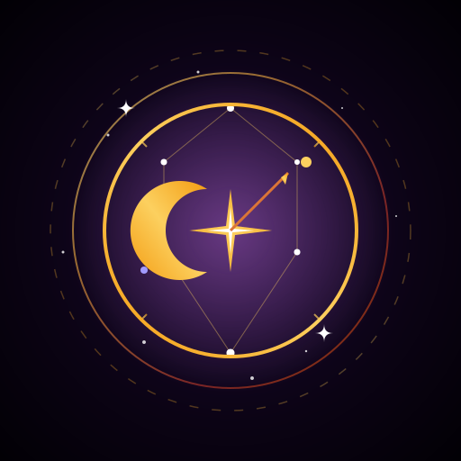

# Odysseia

<p align="center">
  
</p>

<p align="center">
  <strong>Núcleo mítico de DrakesCraft para Purpur/Paper 1.21.x</strong><br>
  Bosses, reliquias, tienda, presencia, moderación visual y utilidades premium en un solo plugin.
</p>

---

## Qué es hoy Odysseia

**Odysseia** ya no es solamente un reemplazo elegante de un puñado de scripts viejos.
Hoy es el plugin central que sostiene buena parte de la identidad de **DrakesCraft**:

- jefes míticos multi-fase con drops legendarios
- reliquias activas con habilidades reales en combate
- integración de tienda con delivery automático y anuncios sincronizados
- presencia y logs hacia Discord por webhook
- vanish y moderación con estética propia
- ciclos visuales de dueños y placeholders
- utilidades survival personalizadas como `Papa de Mar`, `Leñador Loco` y `ChatGames`
- contención de abuso de ítems `SFMaster`

El objetivo del proyecto es simple: que el servidor se sienta como una experiencia propia, no como una suma de plugins desconectados.

---

## Stack objetivo

- **Servidor:** Purpur / Paper 1.21.x
- **Java:** 21
- **Build:** Maven
- **Dependencias suaves:** PlaceholderAPI, LuckPerms, Essentials

---

## Módulos principales

### 1. Panteón de bosses

Odysseia implementa un sistema completo de bosses míticos con barra, fases, skills, drops y anuncios:

- Thor
- Ares
- Hades
- Poseidón
- Zeus
- Loki
- Odin
- Kratos
- Heimdall
- Hidra
- Cerbero
- Artemisa
- Tifón
- Prometeo

Además mantiene compatibilidad con jefes previos como `Circe`, `Polifemo` y `Dios Corrupto`.

#### Capacidades del sistema

- spawn manual por comando
- invocadores únicos por boss
- anuncios globales con anti-spam
- soporte de spawn natural configurable
- bossbars y seguimiento de jugadores cercanos
- skills especializadas por entidad
- drops manuales garantizados al morir
- webhooks de spawn y kill a Discord

### 2. Reliquias y armas míticas

Los drops de bosses no son decorativos. `BossItemListener` implementa comportamiento real para reliquias como:

- `Mjolnir`
- `Filo de Ares`
- `Escudo Espartano`
- `Guadaña de Hades`
- `Tridente de Poseidón`
- `Maza de Zeus`
- `Daga de Loki`
- `Cetro de Loki`
- `Lanza de Odin`
- `Casco de Odin`
- `Espadas del Caos`
- `Hacha Leviatán`
- `Gjallarhorn`
- `Alas del Bifröst`
- `Colmillo de la Hidra`
- `Escama de la Hidra`
- `Piel de Cerbero`
- `Arco Lunar de Artemisa`
- `Garra de Tifón`
- `Coraza del Padre Monstruo`
- `Llama Eterna de Prometeo`

Incluye efectos como:

- rayos y tormentas
- tsunamis y knockback en área
- veneno y wither
- invisibilidad parcial de Loki
- escarcha y retorno rúnico del Hacha Leviatán
- sincronización dual de las Espadas del Caos
- tirones, fuego, cadenas visuales y partículas

### 3. Tienda y entregas

Odysseia incluye un `StoreManager` para delivery automático contra backend externo:

- consulta compras pendientes
- ejecuta comandos de entrega en hilo principal
- confirma transacciones al backend
- dispara anuncio global y webhook de felicitación
- soporta comando manual `/odysseiaannounce <nick> <producto...>` para Tebex

Esto permite que el flujo de tienda quede unificado entre:

- backend web
- plugin del servidor
- chat in-game
- sonido global
- Discord

### 4. Presencia y eventos Discord

`PresenceEventListener` y utilidades relacionadas cubren:

- startup y shutdown del servidor
- join y quit
- muertes
- avances reales del jugador
- heartbeat periódico

Todo con rate-limit y entrega asíncrona endurecida.

### 5. Moderación visual y vanish

Odysseia mantiene una capa de moderación estilizada:

- `/vanish` con partículas y sonido
- ocultación de staff invisible
- silenciamiento visual en entradas y salidas
- eventos de kick / ban reportados a Discord
- efectos visuales de castigo in-world

### 6. Utilidades survival personalizadas

El plugin también concentra piezas históricas del servidor:

- `Papa de Mar`
- `Leñador Loco`
- `ChatGames` programado
- ciclo de prefijos del owner
- placeholders para integración visual
- efectos de armadura por rango

### 7. Control de abuso SFMaster

`SFMasterWatcherListener` marca ítems generados por cheat y bloquea abuso en:

- drop al suelo
- venta por subasta
- movimiento y colocación de ciertos ítems
- persistencia y rastreo de bloques ligados al modo SFMaster

No es un sistema cosmético: es una barrera para evitar que el acceso temporal a Slimefun Cheat rompa la economía.

---

## Comandos principales

### Administración

- `/boss spawn <tipo>`
- `/boss give <jugador> <tipo>`
- `/vanish`
- `/lenador [nivel]`
- `/papademar`

### Tienda / anuncios

- `/odysseiaannounce <nick> <producto...>`

---

## Integraciones

### PlaceholderAPI

Expone placeholders para el ciclo visual de dueños:

- `%odysseia_owner_prefix%`
- `%odysseia_owner_prefix_odiseo%`
- `%odysseia_owner_prefix_penelope%`

### LuckPerms

Usado para:

- detección de grupos y permisos
- rangos temporales de tienda
- chequeo de presencia de dueños

### Essentials

Usado para:

- permisos de kits VIP
- coherencia con perks y economía del servidor

---

## Configuración importante

Las áreas de configuración más relevantes están en `src/main/resources/config.yml`.

### Bloques clave

- `discord`
- `owner-cycle`
- `armor-effects`
- `papa-de-mar`
- `chatgames`
- `store`
- `natural-spawn`
- `kits`

### Ejemplos de uso real

#### Tienda

```yaml
store:
  enabled: true
  poll-interval-seconds: 60
  announcement-webhook-url: "https://discord.com/api/webhooks/..."
```

#### Spawn natural de bosses

```yaml
natural-spawn:
  enabled: false
  interval-seconds: 1800
  chance: 0.25
  max-active: 2
```

#### Owner cycle

```yaml
owner-cycle:
  enabled: true
  interval-minutes: 30
```

---

## Seguridad y hardening

Odysseia ya trae varias decisiones defensivas:

- webhooks enviados fuera del hilo principal
- validación estricta de URL HTTPS permitidas
- manejo de `429` y `Retry-After`
- descarte de entregas duplicadas en vuelo
- anti-spam de anuncios globales de bosses
- limpieza segura de entidades y bossbars
- control de ítems temporales o visuales para evitar exploits

No intenta ser un framework genérico. Está endurecido para el flujo operativo real de DrakesCraft.

---

## Build

```bash
mvn clean package
```

El jar final queda en:

```text
target/Odysseia-1.0.0-SNAPSHOT.jar
```

---

## Despliegue típico

```bash
cp target/Odysseia-1.0.0-SNAPSHOT.jar /ruta/al/servidor/plugins/Odysseia.jar
```

En DrakesCraft se despliega sobre el `plugins/Odysseia.jar` del servidor principal y toma la configuración persistida desde su carpeta de datos.

---

## Documentación adicional

- `EXPANSION_II_BOSSES.md`
- `EXPANSION_III_BOSSES.md`

Esos documentos sirven como bitácora de crecimiento del sistema mítico, pero el estado más real y actual del plugin vive en:

- `src/main/java/...`
- `src/main/resources/config.yml`
- este `README`

---

## Filosofía del proyecto

Odysseia existe para que DrakesCraft tenga:

- una capa de fantasía coherente
- un endgame con identidad
- una tienda integrada sin parches frágiles
- menos Skript improvisado
- más control técnico y menos ruido operativo

Si el servidor se siente como un mundo propio y no como un collage de automatizaciones, entonces el plugin está haciendo bien su trabajo.
